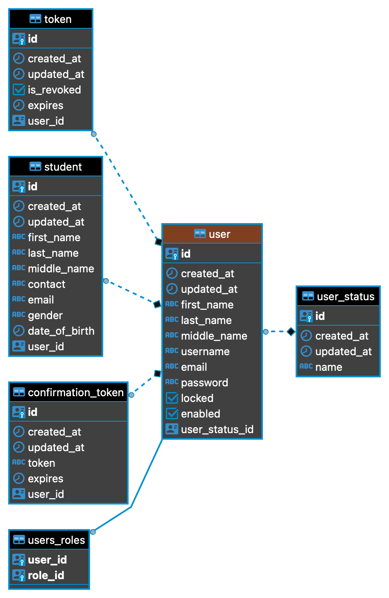

# SMS_Service 

# Functional Requirement 
## 4.4.1.1 Admin (Headmaster)
- Create, edit and delete student account.
- Create, edit and delete tutor account.
- Create, edit and delete parent account.
- Post tasks or any updates for users (Tutor, Student, and Parent). - Store, edit, delete, calculate and print student's grade.
- Add Classes and Subject and connect them with the subject’s tutors.

## 4.4.1.2 Tutor
- Enter Student's grades per Subject.
- Contact with students and parents.
- Post tasks or any updates for users (Admin, Student, and Parent).

## 4.4.1.3 Student
- View their grades.
- Contact with their tutor and headmaster.

##   4.4.1.4 Parent
- View the grades of their children.
- Contact with their children’s teachers and headmaster.

## 5.4.2 Database Schema

### User

User Schema 

### Role

Role Schema 

### Student

Student Schema 

### Course-Subjects

Course-Subjects 

### Tutor

Tutor 